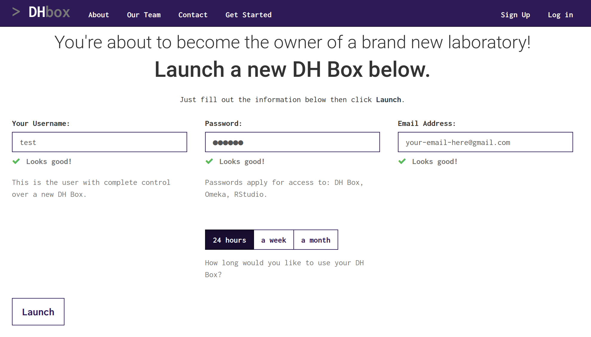
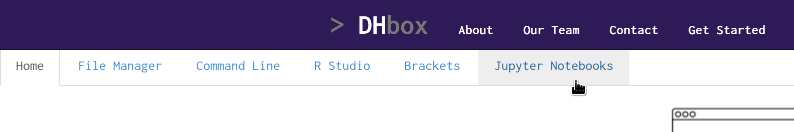
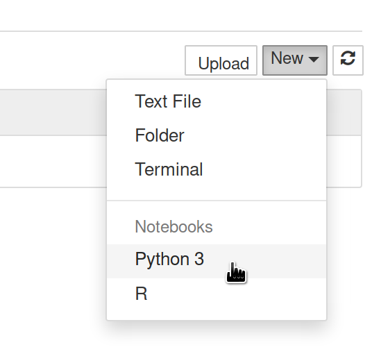
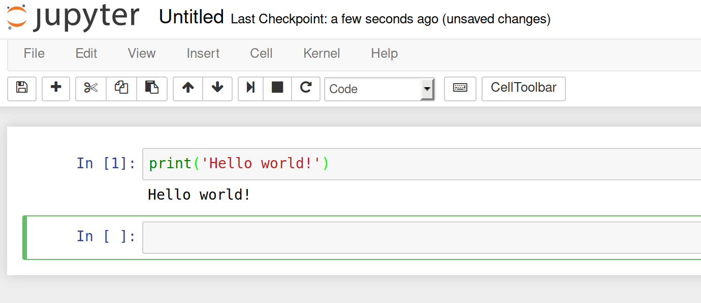
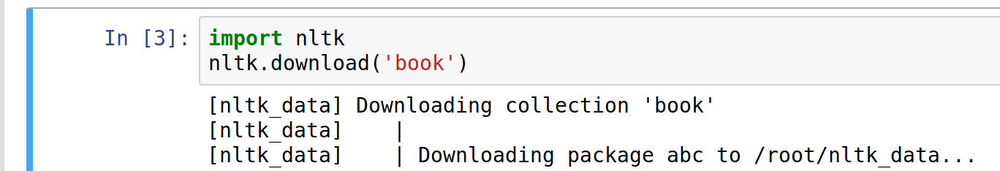
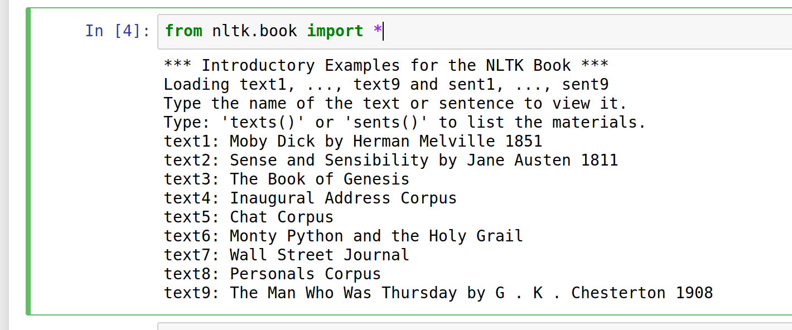
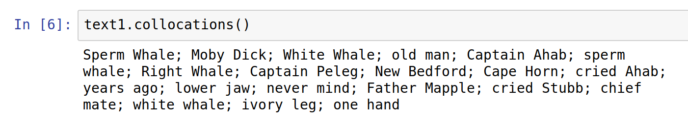
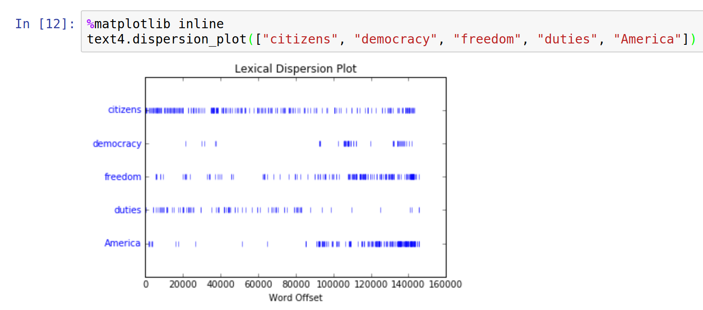

# An Introduction to Text Analysis with DH Box

This tutorial will show you how to get started with text analysis, using nothing but a web browser. We'll be using [http://dhbox.org](DH Box), a Digital Humanities cloud workstation, as our complete software stack. This tutorial assumes no prior knowledge of text analysis, digital humanities, or computer programming. 

1. Navigate to [http://dhbox.org](dhbox.org) in your web browser. Click "sign up" in the upper right corner. Enter a username, password, and your email address. Take note of these so that you can use them later. Click "launch." 

2. After your DH Box is finished building, you should see a series of tabs across the top, with names like "File Manager," "Command Line," and so on. Click the tab called "Jupyter Notebooks," and enter the password you chose in step 1. Click "log in." You're now logged in to Jupyter, a platform for executing code. 

3. Click the button "New" in the upper right corner, followed by "Python" This will start a new Jupyter Notebook using the Python programming language. 

4. You should now see a box containing the text `In [ ]:`. Click in the box next to that colon. Type `print('Hello World!')` exactly, making sure to include the parentheses and quotation marks. Now run this cell by choosing "Run cells" from the "Cell" menu, clicking the triangle "play" (run) button, or by pressing Shift+Enter. You should see the output "Hello world!"! Congratulations! You've just written your first Python program. 

5. Now let's get to the text analysis. We'll be using a Python text analysis library called the Natural Language ToolKit, or NLTK. First, let's download the NLTK test documents. In a new cell, type `import nltk`, press Enter, and on a new line, type `nltk.download('book')`. This should show you many lines of output, beginning with `[nltk_data] Downloading collection 'book'`. 

6. Next, we'll load those test texts into memory. Run the command `from nltk.book import *`. This should load the test texts into the variables `text1`, `text2`, and so on. 

7. Now we can run analytic tasks on these test texts. For example, to find frequently co-occurring words for Moby Dick, we can run `test1.collocations()`. Make sure to type the command exactly, including the parentheses. 

8. We can even plot things in this notebook, provided we first run the command `%matplotlib inline`. For example, we can produce a dispersion plot of a few terms in the US inaugural address corpus by running `text4.dispersion_plot(["citizens", "democracy", "freedom", "duties", "America"])`. In the screenshot below, you can see the term "America" becoming much more popular toward the end of the 20th Century, and the term "duties" falling completely out of fashion. Replace these words with your own, or replace `text4` with a different text to create your own dispersion plot.

That's it! To learn more, check out the [NLTK Book](http://www.nltk.org/book/ch01.html), starting at Chapter 1, section 1.4. You can also read [the notebook from the text analysis workshop I gave recently](https://github.com/JonathanReeve/dataviz-workshop-2017/blob/master/dataviz-workshop.ipynb).
